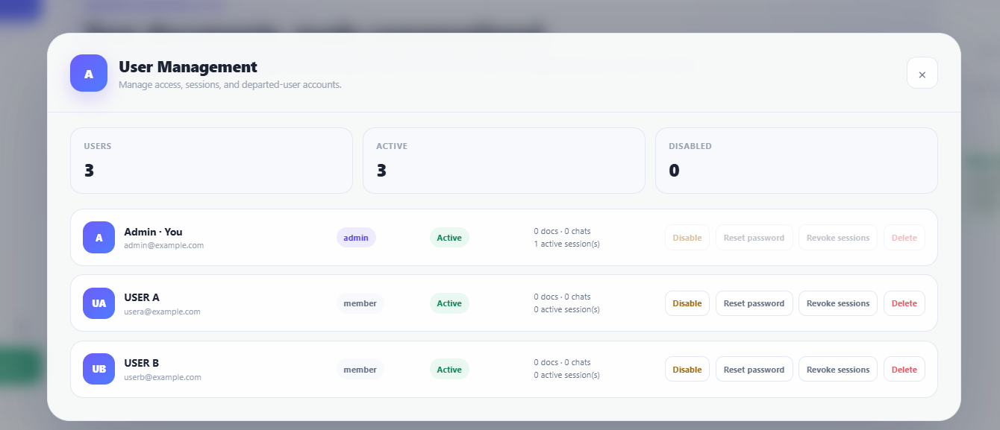
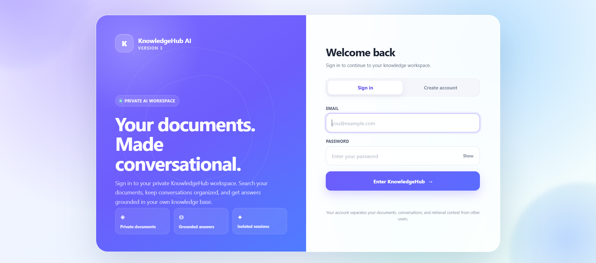
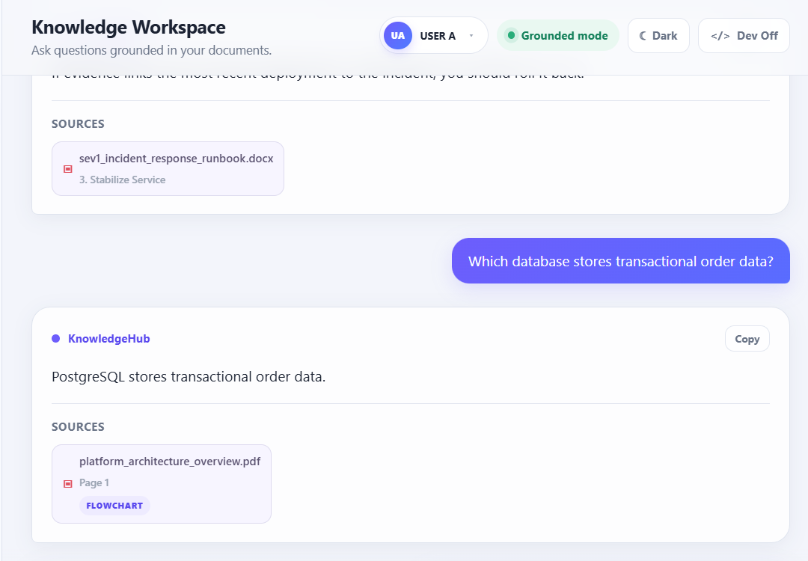
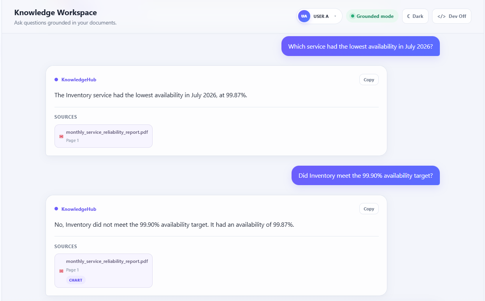
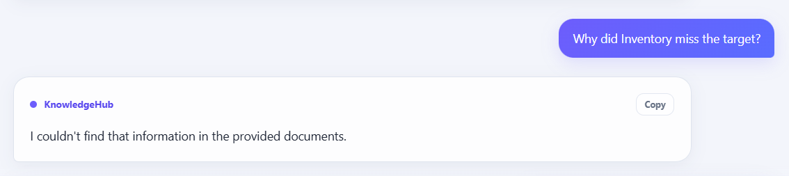
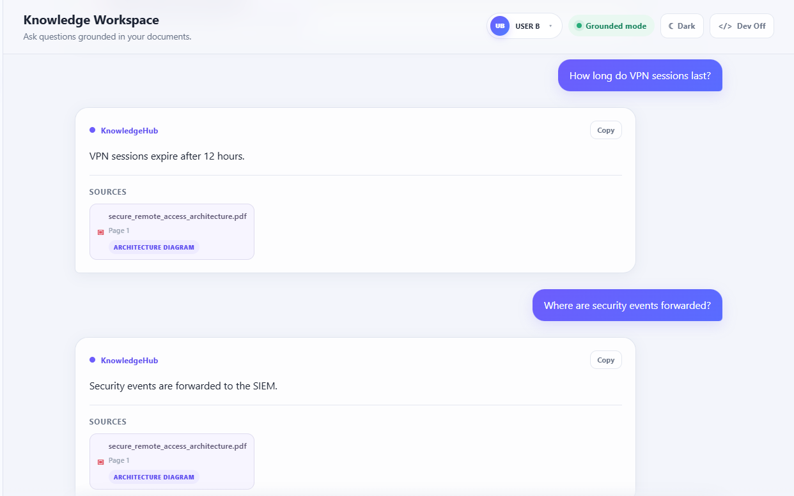
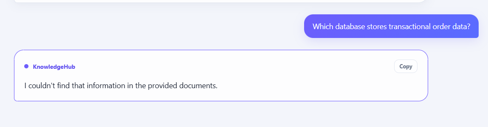
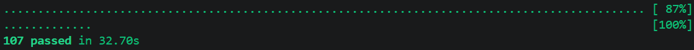

# KnowledgeHub AI

**KnowledgeHub AI** is a multi-user, multimodal Retrieval-Augmented Generation (RAG) application that allows users to build private knowledge bases from their documents and ask questions grounded in the information those documents contain.

The project was built iteratively across three versions, evolving from a basic document-question-answering pipeline into a more complete knowledge workspace with authentication, user isolation, multimodal document understanding, hybrid retrieval, conversational follow-ups, source transparency, and automated testing.

---

## KnowledgeHub AI V3

V3 focuses on making the application behave more like a real multi-user AI knowledge system rather than a single-user RAG prototype.

Major additions include:

- User authentication and account management
- Private per-user knowledge bases
- Cross-user document and retrieval isolation
- Admin user-management capabilities
- Multi-format document ingestion
- Multimodal document understanding
- Chart, flowchart, and architecture-diagram interpretation
- Hybrid semantic + lexical retrieval
- Wider candidate retrieval followed by reranking
- Conversational follow-up questions
- Grounded answer generation
- Unsupported-question rejection
- Source metadata and evidence display
- Expanded automated test coverage

---

## Screenshots

### Admin User Management

Administrators can manage application users, account state, sessions, and user access.



---

### Authentication

KnowledgeHub AI V3 introduces authenticated workspaces so documents, conversations, and retrieval context can remain isolated between users.



---

### Multimodal Flowchart Retrieval

KnowledgeHub can retrieve information represented visually inside documents instead of relying exclusively on extracted paragraph text.



---

### Chart Reasoning and Grounded Analysis

Visual document content can participate in retrieval and answer generation.

In this example, KnowledgeHub interprets service availability information contained in a chart and answers both a direct question and a conversational follow-up.



---

### Grounded Rejection

KnowledgeHub is designed not to invent an answer when the retrieved documents do not provide sufficient evidence.



---

### Separate User Knowledge Base

A second authenticated user can maintain a completely different document collection and retrieve information from their own technical documents.



---

### Cross-User Data Isolation

A user cannot retrieve information that exists only inside another user's knowledge base.



---

### Automated Testing

The final V3 build passes the complete automated test suite:

**107 tests passed**



---

# How It Works

At a high level, KnowledgeHub follows this pipeline:

```text
Document Upload
      ↓
Document Type Detection
      ↓
Format-Specific Parsing
      ↓
Text + Visual Content Extraction
      ↓
Chunking
      ↓
Embedding Generation
      ↓
PostgreSQL + pgvector
      ↓
Semantic Candidate Retrieval
      ↓
Hybrid Reranking
      ↓
Candidate Relevance Gate
      ↓
Grounded LLM Answer Generation
      ↓
Answer + Supporting Sources
```

---

# Hybrid Retrieval

V3 moves beyond relying only on vector similarity.

The retrieval system first obtains a wider semantic candidate pool and then reranks those candidates using a hybrid relevance score.

The current hybrid score combines:

```text
70% Semantic Similarity
30% Lexical Relevance
```

Conceptually:

```python
hybrid_score = (
    0.70 * vector_similarity
    + 0.30 * lexical_relevance
)
```

The candidate retrieval stage searches a pool of at least **50 chunks** before reranking and returning the strongest candidates.

This helps recover document passages that may contain important exact terminology while still benefiting from semantic similarity.

---

# Multimodal Document Understanding

Traditional RAG systems frequently depend only on extracted text.

That creates problems when important information exists inside:

- Charts
- Architecture diagrams
- Flowcharts
- Screenshots
- Scanned pages
- Images containing text
- Other document visuals

KnowledgeHub V3 introduces a visual-analysis pipeline that uses Gemini multimodal capabilities to convert useful visual information into structured textual evidence.

Recognized visual categories include:

```text
architecture_diagram
flowchart
chart
screenshot
scanned_page
image_with_text
diagram
other_visual
```

The resulting visual evidence can then participate in embedding, retrieval, reranking, and grounded answer generation alongside ordinary document text.

---

# Multi-Format Document Processing

V3 introduces a parser architecture instead of coupling document processing to a single format.

Current parser modules include:

```text
backend/parsers/
├── base.py
├── pdf_parser.py
├── docx_parser.py
├── markdown_parser.py
├── txt_parser.py
└── __init__.py
```

This makes document ingestion easier to extend as additional formats are introduced.

---

# Authentication and User Isolation

KnowledgeHub V3 supports multiple authenticated users.

User records include account information such as:

- Role
- Active/disabled state
- Password-change state
- Authentication/session information

The first registered account can become the application administrator.

More importantly, document retrieval is scoped by user identity.

Conceptually:

```text
USER A
 ├── Documents A1, A2, A3
 ├── Conversations
 └── Retrieval Context

USER B
 ├── Documents B1, B2
 ├── Conversations
 └── Retrieval Context
```

User A's retrieval operations should not expose User B's private document chunks, and vice versa.

This isolation is validated through both automated tests and manual smoke testing.

---

# Grounded Answer Generation

KnowledgeHub follows a document-grounded answering strategy.

Retrieved candidates must pass the relevance stage before being supplied as supporting context for answer generation.

When sufficient supporting information is unavailable, KnowledgeHub can reject the question rather than generating an unsupported answer.

Example:

```text
User:
Why did Inventory miss the target?

KnowledgeHub:
I couldn't find that information in the provided documents.
```

This distinction is important.

The documents may prove that Inventory missed its availability target without explaining **why** it happened.

KnowledgeHub therefore avoids inventing a cause.

---

# Conversational Follow-Ups

KnowledgeHub maintains limited recent conversation context so users can ask natural follow-up questions.

Example:

```text
User:
Which service had the highest availability?

KnowledgeHub:
The Checkout service had the highest availability at 99.98%.

User:
What about Payments?

KnowledgeHub:
The Payments service had an availability of 99.95% in July 2026.
```

Conversation history is used to resolve what the user is referring to, while document evidence remains the basis for the final answer.

---

# Sources and Transparency

Answers can include supporting source information such as:

- Filename
- Page number
- Section
- Chunk index
- Source metadata
- Retrieval relevance

This makes the RAG process easier to inspect and helps users understand where an answer originated.

---

# Technology Stack

### Backend

- Python
- FastAPI
- PostgreSQL
- pgvector
- Gemini API

### Document Processing

- PyMuPDF
- PDF parsing
- DOCX parsing
- Markdown parsing
- TXT parsing
- Gemini multimodal visual analysis

### Retrieval

- Vector embeddings
- PostgreSQL + pgvector similarity search
- Lexical relevance scoring
- Hybrid reranking
- Candidate relevance gating

### Frontend

- HTML
- CSS
- JavaScript

### Testing

- pytest

---

# Project Structure

```text
KnowledgeHub-AI/
│
├── backend/
│   ├── parsers/
│   │   ├── __init__.py
│   │   ├── base.py
│   │   ├── docx_parser.py
│   │   ├── markdown_parser.py
│   │   ├── pdf_parser.py
│   │   └── txt_parser.py
│   │
│   ├── auth.py
│   ├── db.py
│   ├── ingest.py
│   ├── main.py
│   ├── process_document.py
│   ├── rag.py
│   ├── search.py
│   ├── visual_analyzer.py
│   ├── evaluate_rag.py
│   └── evaluate_retrieval.py
│
├── frontend/
│   └── index.html
│
├── screenshots/
│   └── V3/
│
├── tests/
│
├── .env.example
├── .gitignore
├── requirements.txt
└── README.md
```

---

# Setup

## 1. Clone the Repository

```bash
git clone <your-repository-url>
cd KnowledgeHub-AI
```

## 2. Create a Virtual Environment

Windows:

```bash
python -m venv .venv
.venv\Scripts\activate
```

macOS/Linux:

```bash
python3 -m venv .venv
source .venv/bin/activate
```

## 3. Install Dependencies

```bash
pip install -r requirements.txt
```

## 4. Configure Environment Variables

Copy:

```text
.env.example
```

to:

```text
backend/.env
```

Then configure the required values.

Example:

```env
GEMINI_API_KEY=your_gemini_api_key
GEMINI_VISUAL_MODEL=gemini-3.1-flash-lite

POSTGRES_HOST=localhost
POSTGRES_PORT=5432
POSTGRES_DB=knowledgehub
POSTGRES_USER=postgres
POSTGRES_PASSWORD=your_postgres_password
```

Never commit the real `.env` file.

---

# Running the Application

From the backend directory:

```bash
cd backend
uvicorn main:app --reload
```

Then open the application frontend using the project's local frontend workflow.

---

# Running Tests

From the project root:

```bash
pytest
```

Final V3 validation:

```text
107 passed
```

---

# Version Evolution

## V1 — Core RAG Pipeline

The first version focused on understanding the complete RAG workflow:

- PDF ingestion
- Text extraction
- Chunking
- Gemini embeddings
- PostgreSQL + pgvector
- Vector similarity search
- Grounded answer generation
- Source display
- Basic relevance rejection
- Multiple chat sessions
- Automated testing

---

## V2 — Reliability and Conversational RAG

V2 focused on making the RAG application more transparent and reliable.

Major improvements included:

- Multi-document knowledge base
- Conversational follow-up questions
- Sources & Context inspection
- Developer-oriented retrieval visibility
- Improved grounded rejection behavior
- Expanded RAG evaluation and automated testing

---

## V3 — Multi-User Multimodal Knowledge Workspace

V3 expands the project significantly:

- Authentication
- User roles
- Admin user management
- User-specific knowledge bases
- Cross-user retrieval isolation
- Multi-format parsers
- Multimodal visual understanding
- Chart reasoning
- Flowchart understanding
- Architecture-diagram understanding
- Hybrid semantic + lexical retrieval
- Wider candidate retrieval and reranking
- Improved conversational retrieval
- Source metadata
- Production-oriented robustness testing
- **107 passing automated tests**

V3 represents the transition from a basic RAG application into a more complete document intelligence and knowledge-workspace system.

---

# Key Engineering Lessons

Building KnowledgeHub across three versions highlighted several important RAG engineering lessons.

### Retrieval quality matters as much as generation

A capable language model cannot answer correctly if the relevant evidence never reaches the generation stage.

### Vector similarity alone is not always enough

Semantically related passages can outrank passages containing the exact information required by the question.

Hybrid retrieval helps combine semantic understanding with lexical evidence.

### Candidate retrieval and final context are different problems

Retrieving a larger candidate pool does not mean sending every candidate to the LLM.

A better architecture is:

```text
Broad Retrieval
      ↓
Reranking
      ↓
Evidence Selection
      ↓
Grounded Generation
```

### Documents are not only text

Important information frequently exists inside charts, diagrams, flowcharts, and other visual elements.

A useful document intelligence system therefore needs to understand both textual and visual evidence.

### Grounded rejection is a feature

Knowing when the documents **do not contain an answer** is as important as answering when they do.

### Multi-user RAG requires retrieval isolation

Authentication alone is insufficient.

Document search itself must be scoped so one user's private knowledge cannot become retrieval context for another user.

---

# Current Status

**KnowledgeHub AI V3 — Complete**

- V3 implementation complete
- Authentication and multi-user isolation implemented
- Multimodal document understanding implemented
- Hybrid retrieval implemented
- Manual smoke testing completed
- **107 automated tests passing**