# KnowledgeHub AI V2

A document-based Retrieval-Augmented Generation (RAG) application that turns uploaded PDF documents into a conversational, inspectable knowledge base.

KnowledgeHub AI V2 builds on the V1 RAG pipeline with a redesigned workspace, multi-document knowledge-base experience, conversational follow-ups, inspectable source evidence, developer-mode retrieval metadata, dark/light themes, stronger grounded rejection behavior, and expanded automated evaluation.

## Features

- Upload and ingest PDF documents through the web interface
- Automatically extract PDF text using PyMuPDF
- Split documents into overlapping text chunks
- Generate vector embeddings using Gemini
- Store documents, chunks, and embeddings in PostgreSQL with pgvector
- Perform semantic similarity retrieval
- Generate answers grounded in retrieved document context
- Reject unsupported questions instead of relying on general model knowledge
- Maintain multiple persistent chat sessions
- Support conversational follow-up questions within a chat
- Load and delete previous conversations
- Manage multiple documents in the knowledge base
- Delete documents and their indexed chunks
- Display source documents with generated answers
- Inspect the actual supporting passages in the **Sources & Context** panel
- Copy generated answers and supporting evidence
- Toggle **Developer Mode** to inspect chunk indexes and relevance scores
- Toggle between light and dark themes
- Persist UI preferences across refreshes
- Automatically navigate to newly generated answers during longer conversations
- Render generated Markdown cleanly in the conversation UI
- Provide improved empty, loading, upload, indexed, and error states
- Evaluate retrieval behavior independently from answer generation
- Run end-to-end RAG evaluation for answer/rejection behavior
- Automated regression coverage for core backend and grounded-source behavior


### KnowledgeHub AI V2 Workspace

The V2 interface introduces a three-part workspace for conversations, the active knowledge workspace, and supporting source evidence.

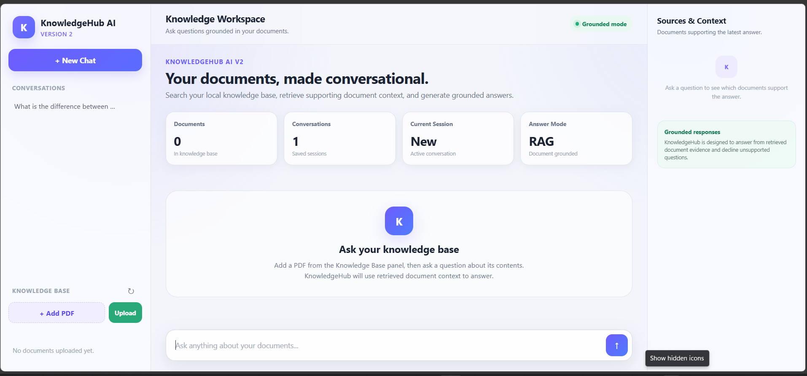

### PDF Upload and Ingestion

PDFs can be selected from the Knowledge Base panel and ingested into the local vector knowledge base.

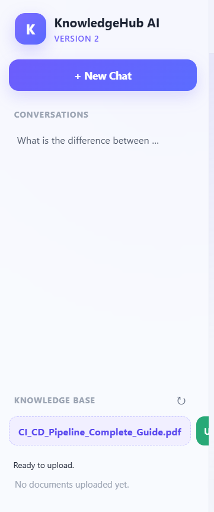

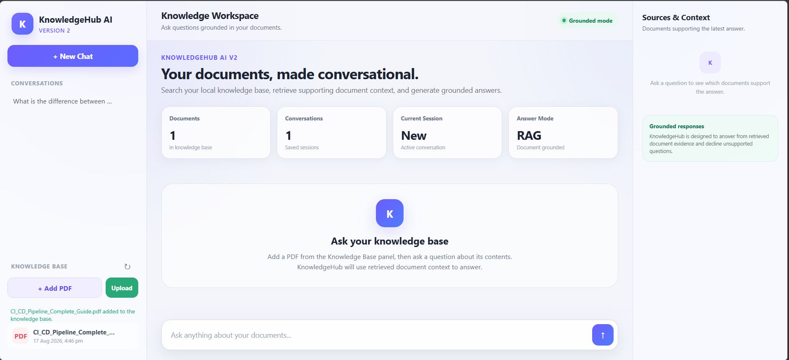

### Multi-Document Knowledge Base

V2 supports multiple indexed PDFs and exposes their state directly in the Knowledge Base panel.

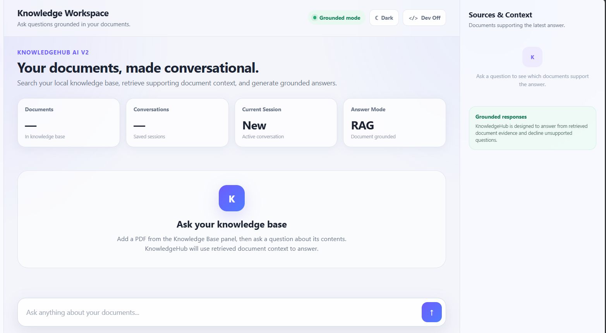

### Grounded Question Answering

KnowledgeHub retrieves relevant document chunks and generates an answer from the retrieved evidence.


### Sources & Context

The right-side evidence panel lets the user inspect the actual retrieved passages used to ground the latest answer instead of seeing only a filename.

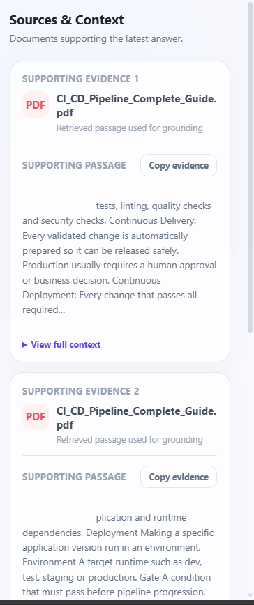

### Developer Mode

Developer Mode exposes retrieval details such as chunk indexes and relevance scores while keeping normal mode focused on readable evidence.

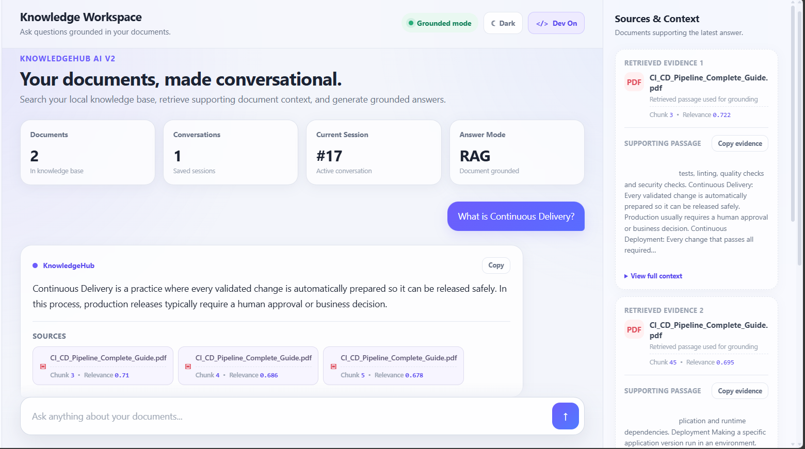

### Conversational Follow-Ups

A user can continue the same conversation with related questions and simpler follow-up requests while retaining the chat session.

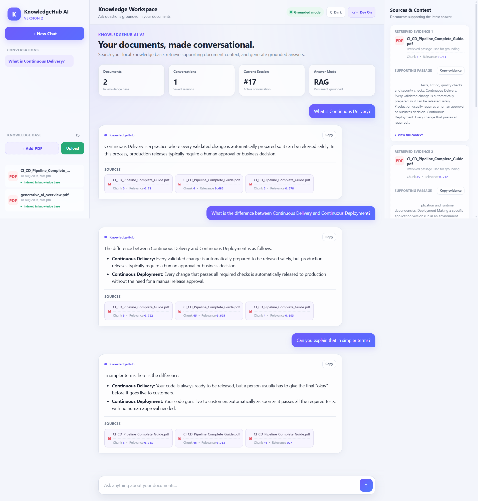

### Grounded Rejection

When the available documents do not support a question, KnowledgeHub declines to answer rather than inventing information.

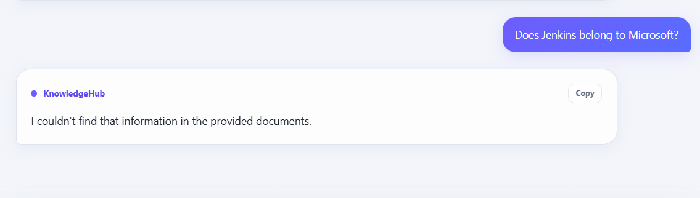

### Dark Mode

The V2 workspace supports a persistent dark theme.

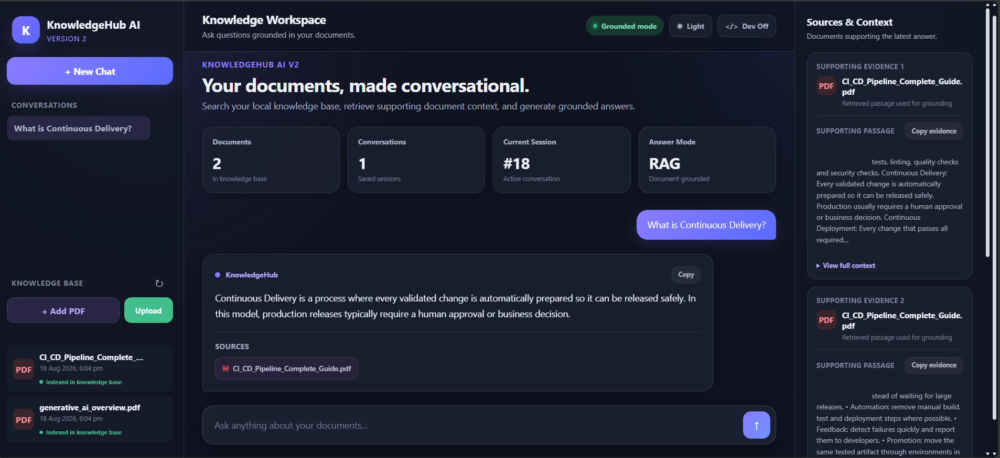

### Automated Testing

The V2 automated regression suite currently passes all tests.

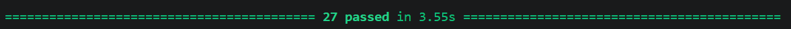

**V2 automated test result: 27/27 passed.**

### End-to-End RAG Evaluation

The end-to-end evaluation checks both answerable and unsupported questions.

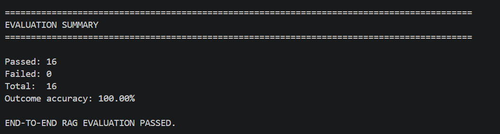

**V2 RAG evaluation result: 16/16 passed — 100% outcome accuracy.**

## What's New in V2

V1 established the complete document RAG pipeline: ingestion, chunking, embeddings, pgvector retrieval, grounded generation, source attribution, document management, chat sessions, and automated testing.

V2 focuses on making that pipeline more usable, inspectable, conversational, and testable.

| Area | V1 | V2 |
| --- | --- | --- |
| RAG pipeline | Grounded document Q&A | Strengthened grounded behavior |
| Knowledge base | PDF upload/list/delete | Polished multi-document workspace |
| Sources | Filename/chunk/relevance | Readable supporting evidence panel |
| Retrieval metadata | Shown with answers | Optional Developer Mode |
| Conversations | Persistent sessions | Conversational follow-ups + improved navigation |
| Answer display | Basic response UI | Markdown rendering + copy action |
| Evidence actions | Not available | Copy supporting evidence |
| Themes | Single theme | Persistent light/dark themes |
| UX states | Functional | Improved empty/loading/error/indexed states |
| Retrieval evaluation | Basic/manual inspection | Dedicated retrieval inspection/evaluation |
| Automated tests | 16 passing | 27 passing |
| End-to-end evaluation | Not formalized | 16/16 passing |

## How It Works

```text
+----------------------+
|      User Uploads    |
|         PDF          |
+----------+-----------+
           |
           v
+----------------------+
|   Text Extraction    |
|      PyMuPDF         |
+----------+-----------+
           |
           v
+----------------------+
|    Text Chunking     |
| 1000 chars / 300     |
|    char overlap      |
+----------+-----------+
           |
           v
+----------------------+
| Gemini Embeddings    |
+----------+-----------+
           |
           v
+----------------------+
| PostgreSQL + pgvector|
| Documents / Chunks   |
| Embeddings / Chats   |
+----------+-----------+
           |
           | User asks question
           v
+----------------------+
| Embed the Question   |
+----------+-----------+
           |
           v
+----------------------+
| Vector Similarity    |
|       Search         |
+----------+-----------+
           |
           v
+----------------------+
| Relevance Filtering  |
+----------+-----------+
           |
           +----------------------+
           |                      |
       Relevant               Unsupported
           |                      |
           v                      v
+----------------------+   +----------------------+
| Retrieved Evidence   |   | Grounded Rejection   |
+----------+-----------+   +----------------------+
           |
           v
+----------------------+
| Gemini Generation    |
| Using Retrieved      |
| Document Context     |
+----------+-----------+
           |
           v
+----------------------+
| Grounded Answer +    |
| Sources + Evidence   |
+----------+-----------+
           |
           v
+----------------------+
| Conversation UI /    |
| Sources & Context    |
+----------------------+
```

## RAG Pipeline

KnowledgeHub AI V2 continues to use a retrieval-augmented generation pipeline.

### 1. Document Ingestion

When a PDF is uploaded, the backend stores it locally and passes it through the ingestion pipeline.

### 2. Text Extraction

Text is extracted from the PDF using PyMuPDF.

### 3. Chunking

Extracted text is divided into overlapping chunks of approximately 1000 characters with a 300-character overlap.

The overlap helps preserve context across neighboring chunks.

### 4. Embedding Generation

Each chunk is converted into a vector embedding using Gemini embeddings.

### 5. Vector Storage

Document metadata, chunk text, and embeddings are stored in PostgreSQL with pgvector.

### 6. Retrieval

A user's question is embedded and compared with stored document vectors.

The closest chunks are retrieved using vector similarity search.

### 7. Relevance Filtering

Retrieved chunks are filtered using the configured retrieval boundary before generation.

This prevents weakly related document passages from automatically becoming answer context.

### 8. Grounded Answer Generation

Relevant chunks are supplied to Gemini with instructions to answer only from the available document evidence.

If the supplied context does not support the requested information, KnowledgeHub returns a grounded fallback rather than answering from general model knowledge.

### 9. Source Attribution and Evidence

For supported answers, V2 can expose:

- Document filename
- Chunk index
- Relevance score
- Retrieved supporting passage

Normal mode emphasizes readable supporting evidence.

Developer Mode additionally exposes retrieval metadata useful for debugging and evaluation.

### 10. Conversation Continuity

Messages are stored by chat session. Follow-up questions can therefore be handled as part of the active conversation rather than as isolated UI interactions.

## Architecture

```text
                         +----------------------+
                         |      V2 Frontend     |
                         |    HTML / CSS / JS   |
                         +----------+-----------+
                                    |
                                    | HTTP
                                    v
                         +----------------------+
                         |       FastAPI        |
                         |       Backend        |
                         +----------+-----------+
                                    |
                 +------------------+------------------+
                 |                  |                  |
                 v                  v                  v
        +----------------+ +----------------+ +----------------+
        |    Document    | |      Chat      | |      RAG       |
        |   Management   | |   Management   | |    Pipeline    |
        +-------+--------+ +-------+--------+ +-------+--------+
                |                  |                  |
                v                  v                  v
        +----------------+ +----------------+ +----------------+
        | Upload / List  | | Create / Load  | | Embeddings     |
        | Delete / Index | | Delete / Store | | Retrieval      |
        +----------------+ | Follow-ups     | | Filtering      |
                           +----------------+ | Generation     |
                                            +-------+--------+
                                                    |
                               +--------------------+--------------------+
                               |                                         |
                               v                                         v
                      +------------------+                      +------------------+
                      | PostgreSQL       |                      |    Gemini API    |
                      | + pgvector       |                      +------------------+
                      +------------------+
                               |
                               v
                      +------------------+
                      | Sources / Chats  |
                      | Evidence / State |
                      +------------------+
```

## Technology Stack

| Component | Technology |
| --- | --- |
| Frontend | HTML, CSS, JavaScript |
| Backend API | FastAPI |
| Language | Python |
| Database | PostgreSQL |
| Vector Search | pgvector |
| Embeddings | Gemini Embeddings |
| Generation | Gemini |
| PDF Processing | PyMuPDF |
| Database Driver | psycopg |
| Environment Configuration | python-dotenv |
| Testing | pytest |

## Project Structure

```text
KnowledgeHub-AI/
|
+-- backend/
|   +-- db.py
|   +-- embedding.py
|   +-- ingest.py
|   +-- main.py
|   +-- process_document.py
|   +-- rag.py
|   +-- search.py
|   +-- evaluate_retrieval.py
|   +-- evaluate_rag.py
|   +-- .env                  # Local only - not committed
|
+-- documents/
|   +-- .gitkeep
|   +-- Uploaded PDFs         # Local only - not committed
|
+-- frontend/
|   +-- index.html
|
+-- tests/
|   +-- automated test files
|
+-- screenshots/
|   +-- V1/
|   +-- V2/
|
+-- .gitignore
+-- README.md
```

> Adjust this tree if your final V2 branch uses slightly different test or screenshot filenames.

## Environment Variables

The backend uses local environment variables for Gemini and PostgreSQL configuration.

Create:

```text
backend/.env
```

Example:

```env
GEMINI_API_KEY=your_gemini_api_key

POSTGRES_HOST=localhost
POSTGRES_PORT=5432
POSTGRES_DB=knowledgehub
POSTGRES_USER=postgres
POSTGRES_PASSWORD=your_postgres_password
```

**Never commit the `.env` file or real API credentials.**

Uploaded documents, credentials, Python cache files, and other local-only files should remain excluded through `.gitignore`.

## Running Locally

### 1. Clone the Repository

```bash
git clone https://github.com/phaneendrakatakam/KnowledgeHub-AI.git
cd KnowledgeHub-AI
```

To work specifically with the V2 development branch:

```bash
git checkout v2-development
```

### 2. Configure PostgreSQL

Create the PostgreSQL database:

```text
knowledgehub
```

Ensure the pgvector extension is available.

### 3. Configure Environment Variables

Create `backend/.env` and add the required Gemini and PostgreSQL configuration.

### 4. Start the Backend

```bash
cd backend
python -m uvicorn main:app --reload
```

The local FastAPI backend runs at:

```text
http://127.0.0.1:8000
```

### 5. Open the Frontend

Open:

```text
frontend/index.html
```

in a browser.

The frontend communicates with FastAPI and provides the complete V2 knowledge workspace.

## API Endpoints

### Health Check

```http
GET /
```

Confirms that the backend is running.

### Upload Document

```http
POST /documents/upload
```

Uploads and ingests a PDF.

### List Documents

```http
GET /documents
```

Returns indexed documents.

### Delete Document

```http
DELETE /documents/{document_id}
```

Deletes the document record and its associated indexed chunks.

### Create Chat

```http
POST /chats
```

Creates a new chat session.

### List Chats

```http
GET /chats
```

Returns saved chat sessions.

### Load Chat

```http
GET /chats/{session_id}
```

Loads a chat and its stored messages.

### Delete Chat

```http
DELETE /chats/{session_id}
```

Deletes a chat session and its messages.

### Ask a Question

```http
POST /ask
```

Processes a question through retrieval, relevance filtering, grounded generation, source attribution, and chat persistence.

## Example Workflow

1. Start PostgreSQL with pgvector enabled.
2. Configure `backend/.env`.
3. Start the FastAPI backend.
4. Open the V2 frontend.
5. Add a PDF from the Knowledge Base panel.
6. Upload and wait for ingestion to complete.
7. Ask a question supported by the uploaded document.
8. KnowledgeHub embeds the question and retrieves candidate chunks.
9. Retrieval filtering determines which evidence is sufficiently relevant.
10. Gemini generates an answer from the retrieved context.
11. The answer and its source information appear in the conversation.
12. Inspect the supporting passage in **Sources & Context**.
13. Enable **Developer Mode** to inspect chunk and relevance metadata.
14. Ask a conversational follow-up in the same session.
15. Ask an unsupported question to verify grounded rejection behavior.

## Testing

KnowledgeHub AI V2 uses automated tests, manual regression testing, retrieval inspection, and end-to-end RAG evaluation.

### Automated Testing

Run the complete automated suite from the project root:

```bash
python -m pytest -v
```

Current V2 result:

```text
27 passed
```

The suite covers core behavior including:

- PDF extraction and processing
- Chunk creation and overlap behavior
- Embedding flow with mocks
- Search behavior
- Search limits and empty results
- Relevance filtering
- RAG fallback behavior
- Prompt/context construction
- Source attribution
- Multiple sources
- Grounded rejection behavior
- Rejected-answer source handling
- Additional V2 backend regression cases

External dependencies are mocked where appropriate so application logic can be tested without unnecessary Gemini API or database calls.

### Retrieval Evaluation

V2 includes a retrieval evaluation workflow that inspects:

- Retrieved chunks
- Vector distance
- Display relevance
- Threshold behavior
- Answerable questions
- Questions expected to be rejected

This makes retrieval behavior observable independently of generation.

### End-to-End RAG Evaluation

Run:

```bash
cd backend
python evaluate_rag.py
```

Current V2 result:

```text
Passed: 16
Failed: 0
Total: 16
Outcome accuracy: 100.00%

END-TO-END RAG EVALUATION PASSED.
```

The evaluation includes both supported document questions and intentionally unsupported questions.

A key rejection case verifies that a semantically related retrieval result does not force an unsupported answer.

For example:

```text
Question:
Does Jenkins belong to Microsoft?

KnowledgeHub:
I couldn't find that information in the provided documents.
```

The final grounded rejection returns no supporting sources.

### Manual V2 Regression Testing

The completed V2 regression pass covers:

- PDF upload
- PDF ingestion
- Multiple-document display
- Document deletion
- Grounded question answering
- Unsupported-question rejection
- Conversational follow-ups
- Source display
- Supporting evidence display
- Copy answer
- Copy evidence
- Developer Mode
- Dark/light theme switching
- Theme persistence
- Chat creation
- Chat loading
- Chat deletion
- Browser refresh persistence
- Auto-navigation to newly generated answers
- Automated test suite
- Retrieval evaluation
- End-to-end RAG evaluation

## Grounding Philosophy

KnowledgeHub is intentionally document-grounded.

A language model may know an answer from its general training, but KnowledgeHub should not use that knowledge unless the uploaded documents provide sufficient evidence.

This means:

```text
Relevant document evidence
        |
        v
Generate grounded answer
```

while:

```text
Insufficient / unsupported evidence
        |
        v
Decline to answer
```

This behavior is a core part of the project rather than simply an error state.

## Developer Mode

Developer Mode is intended for inspecting retrieval behavior without cluttering the normal user experience.

When disabled, the Sources & Context panel focuses on:

- Source document
- Supporting passage
- Evidence inspection
- Copy evidence

When enabled, additional retrieval metadata is exposed, including:

- Chunk index
- Relevance score

This provides a lightweight debugging surface for understanding why the RAG system selected particular evidence.

## UI and UX Improvements in V2

V2 substantially redesigns the original interface around a knowledge workspace.

Key improvements include:

- Dedicated conversation sidebar
- Dedicated Knowledge Base panel
- Workspace summary cards
- Sources & Context evidence sidebar
- Readable supporting passages
- Developer Mode
- Light/dark themes
- Persistent theme preference
- Copy actions
- Markdown answer rendering
- Improved document states
- Improved empty states
- Improved loading and error feedback
- Automatic navigation to newly generated answers
- Cleaner multi-turn conversation layout

The interface deliberately avoids decorative metrics that do not represent useful application state.

## Security Notes

The repository intentionally excludes sensitive and local-only data such as:

- Gemini API keys
- PostgreSQL credentials
- `.env` files
- Uploaded documents
- Python cache files
- Other machine-specific files

Never hard-code credentials into application source code.

If a credential is accidentally exposed in a public repository, revoke it and replace it immediately.

## Current Limitations

- PDF is currently the supported document format.
- Uploaded documents are stored locally.
- The application currently runs as a local project rather than a production-hosted service.
- Authentication and authorization are not yet implemented.
- Retrieval quality still depends on extraction quality, chunking, embeddings, and similarity configuration.
- The current relevance boundary is application-specific rather than a universally calibrated confidence score.
- The frontend remains a lightweight HTML/CSS/JavaScript application rather than a framework-based frontend.
- Production deployment, centralized observability, and CI/CD automation are outside the current V2 scope.

## V3 Roadmap

Potential V3 improvements include:

- Authentication and authorization
- Additional document formats
- More advanced chunking strategies
- Hybrid retrieval
- Reranking
- Improved retrieval evaluation datasets and metrics
- Production-ready dependency management
- Containerization
- CI/CD automation
- Application observability
- Production deployment
- Larger-scale knowledge-base management
- Additional conversation and evidence navigation improvements

V3 should be driven by measured retrieval/application needs rather than adding complexity solely for feature count.

## Project Status

**KnowledgeHub AI V2 — Complete ✅**

V2 includes:

- Complete V1 document RAG foundation
- Redesigned knowledge workspace
- Multi-document knowledge-base UX
- Persistent conversations
- Conversational follow-ups
- Grounded answer generation
- Strengthened unsupported-question rejection
- Source attribution
- Supporting evidence inspection
- Sources & Context panel
- Copy answer and evidence actions
- Developer Mode
- Chunk/relevance inspection
- Markdown answer rendering
- Light/dark themes with persistence
- Improved application states
- Automatic answer navigation
- Expanded automated regression coverage
- Retrieval evaluation
- End-to-end RAG evaluation
- Full manual V2 regression pass

**Automated test suite: 27/27 passed.**

**End-to-end RAG evaluation: 16/16 passed — 100% outcome accuracy.**

V2 is feature-complete and establishes the next stable foundation for future KnowledgeHub AI development.

## Author

**Phaneendra Katakam**

GitHub: [@phaneendrakatakam](https://github.com/phaneendrakatakam)

